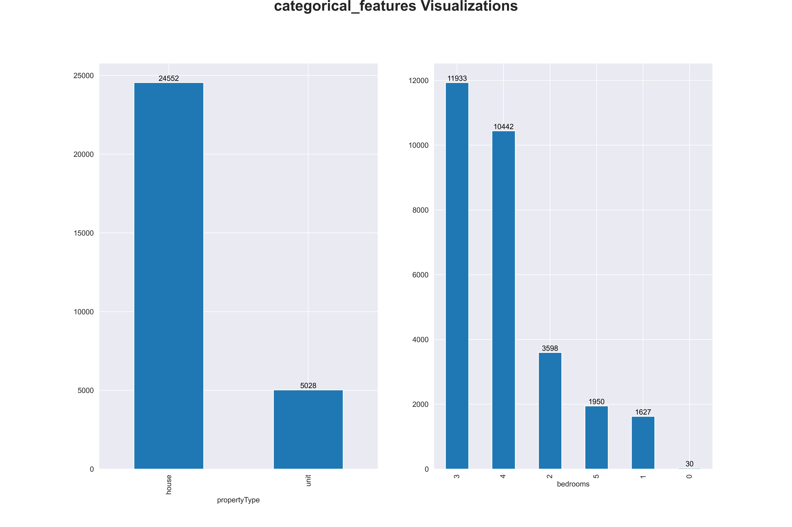
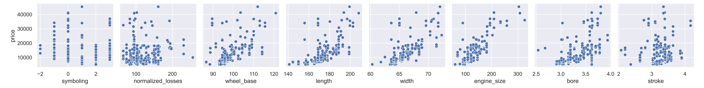
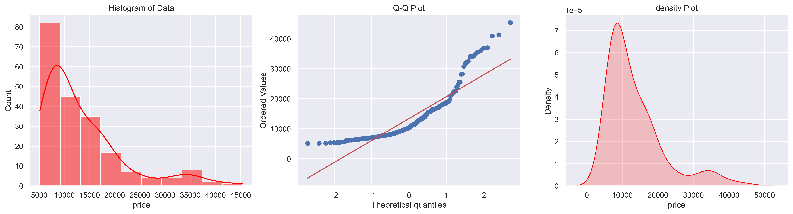
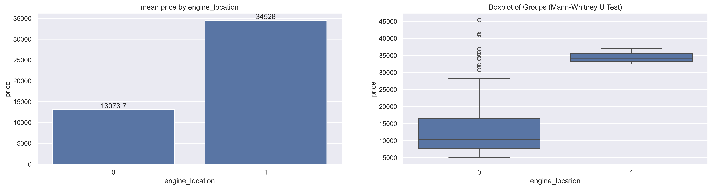
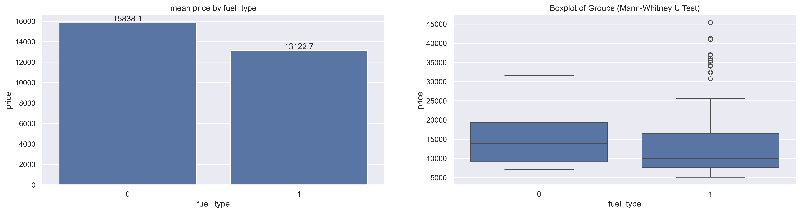
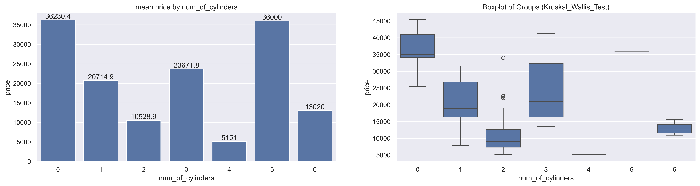
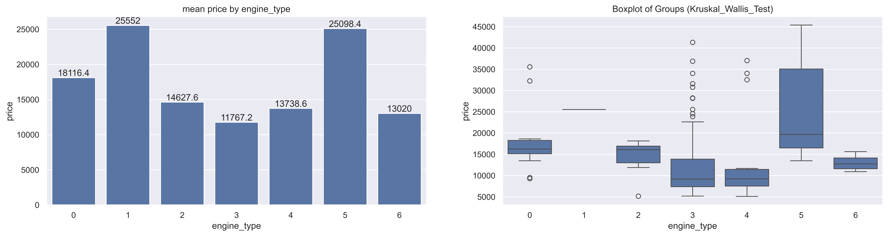
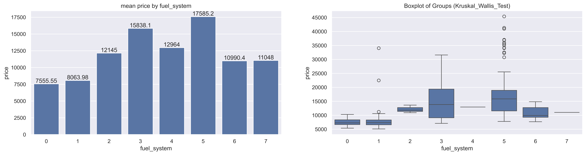
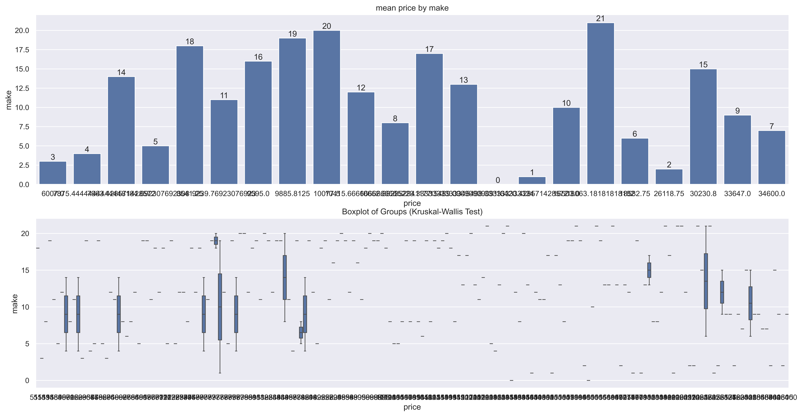

 
# *Auto Mobile price MachineLearning notebooks Using Python Language*

## *Author  [Omar Soub](https://github.com/omars1234)*

## *Overview*


*In this Project ,we will use Python Language and find the best Machine Learning Model for regression problem*

* *To predict the Auto Mobile Prices based on given features inputs Using Python*

* *For detailed data analysis , you can see [*AutoMobilePricesAnalysis-http://rpubs.com/omars/1196926*](http://rpubs.com/omars/1196926) where we have aplplied deep Analysis using R-Programming*


## *Table of Contents*

*  *Installation*  
*  *Data*  
*  *Usage*  
*  *Project Structure*  
*  *Models and Parameters used in hypert tuning*  
*  *Results*  

## *Installation*  
*To run this project, you need to have Python installed on your machine. Additionally, install the required libraries by running the following libraries on requirements.txt file:*

```bash
pandas
numpy
seaborn
matplotlib
scikit-learn
xgboost
tqdm
ipykernel
pyjanitor
feature_engine
hyperopt
```
## *Data*  
*The dataset used for this project contains AutoMobile Insurance data. It includes the following columns:*


## *Usage*

*Clone the repository:*


```bash
https://github.com/omars1234/AutoMobileML.git
```

## *Project Structure*

```bash
Automobile_data_Analysis/
├── DataSet/
│   └── automobile_data.csv
|   └── new_cleaned_df.csv   
├── Notebooks/
│   ├── Analysis.ipynb

├── outcomes/
|   ├── bestModels
|   ├── bestParameters
|   ├── bestParamsevaluation
|   ├── CategoricalFeaturesGrapths
|   ├── correlationGrapths
|   ├── featuresImportanceGraphs
|   ├── modelsEvaluationsGraphs
|   ├── NumericalFeaturesGrapths
|   ├── NumericalFeaturesGrapths
|   ├── pointsplotGrapths
|   ├── PriceByCategories
|
|
├── README.md
├── requiremnts.txt
```

## *Models used :*  

```bash
models = {
                "RandomForestRegressor": RandomForestRegressor(),
                "XGBRFRegressor": XGBRFRegressor(),
                "GradientBoostingRegressor":GradientBoostingRegressor(),
                "AdaBoostRegressor": AdaBoostRegressor()
        }

```
## *Models parameters used for hyperopt :*  

```bash
search_spaces ={        
                "XGBRFRegressor":{
                    "learning_rate": hp.uniform("learning_rate",0.01,1.0),  
                    "max_depth": hp.choice("max_depth", [None,2, 4, 5, 6,7,8]),
                    "subsample": hp.uniform("subsample",0.5,1.0),
                    "n_estimators": hp.choice("n_estimators", [100, 200, 300, 400,500,600])
                    },
                            
                "GradientBoostingRegressor":{
                    "n_estimators": hp.choice("n_estimators", [100, 200, 300, 400,500,600]),
                    "max_depth": hp.choice("max_depth", [2, 4, 5, 6,7,8]),
                    "max_features": hp.choice("max_features",["sqrt", "log2"]),
                    "learning_rate": hp.uniform("learning_rate",0.01,1.0),
                    "subsample": hp.uniform("subsample",0.8,1.0),
                    "min_samples_split": hp.uniform("min_samples_split",0.8,1.0),
                    "min_samples_leaf": hp.uniform("min_samples_leaf",0.8,1.0),
                    "criterion": hp.choice("criterion",["squared_error", "friedman_mse"])
                    },
                "RandomForestRegressor":{
                    "n_estimators": hp.choice("n_estimators", [100, 200, 300, 400,500,600]), 
                    "min_samples_split": hp.uniform("min_samples_split",0.8,1.0),
                    "min_samples_leaf": hp.uniform("min_samples_leaf",0.8,1.0),
                    "bootstrap": hp.choice("bootstrap",[True, False]),                                                                                                    
                    "max_features": hp.choice("max_features",["sqrt", "log2"]),                                    
                    "max_depth": hp.choice("max_depth", [2, 4, 5, 6,7,8]),
                    "criterion": hp.choice("criterion",["poisson", "squared_error", "friedman_mse","absolute_error"]),
                    "max_samples": hp.uniform("max_samples", 0.5, 1.0)                  
                    },

                "AdaBoostRegressor":{
                    "n_estimators": hp.choice("n_estimators", [100, 200, 300, 400,500,600]),
                    "learning_rate": hp.uniform("learning_rate",0.05,1.0)
                    }
                }

```

## *Results*

### *Categorical and Numnerical features distribution :*

*Categorical Features*             |  *Numnerical Features*
:-------------------------:|:-------------------------:
   |   

### *Features Correlation :*


### *scutter plot with price as target feature :*



### *price as target feature- Distribution plot  :*


==> *The price feature is not normally distributed*


### *Price BY Category :*
*price_by_aspiration*  

*price_by_aspiration* | *price_by_engine_location* 
:-------------------------:|:-------------------------:
 |


*price_by_fuel_type* | *price_by_num_of_doors*
:-------------------------:|:-------------------------:
 |


*price_by_num_of_cylinders*  |  *price_by_drive_wheels*
:-------------------------:|:-------------------------:
  | 

*price_by_body_style* | *price_by_engine_type* |
 :-------------------------:|:-------------------------:
  |   

*price_by_fuel_system*|
:-------------------------:
  

*price_by_make*|
:-------------------------:
  


### *Price feature as Regression Target ML :*

* *The best model was RandomForestRegressor()*


*model Residual Graph*     |  *Model Features Importance Graphs*
:-------------------------:|:-------------------------:
   |   

 ----------------------------------------

## *Feedback*

*If you have any feedback, please reach out to us at omars.soub@gmail.com*

## 🔗 Links

[*my github page-https://github.com/omars1234*](https://github.com/omars1234)

## *🛠 Skills*
*python, R, SQL ,PowerBi ,Tableaue*
