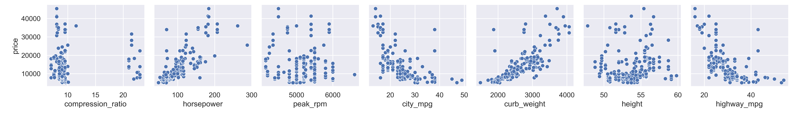

 
# *Auto Mobile price MachineLearning notebooks Using Python Language*

## *Author  [Omar Soub](https://github.com/omars1234)*

## *Overview*


*In this Project ,we will use Python Language and find the best Machine Learning Models with hypert parameter tuning for regression problem*

* *To predict the Auto Mobile Prices based on given features inputs Using Python*

* *For detailed data analysis , you can see [*AutoMobilePricesAnalysis-http://rpubs.com/omars/1196926*](http://rpubs.com/omars/1196926) where we have aplplied deep Analysis using R-Programming*


## *Table of Contents*

*  *Installation*  
*  *Data*  
*  *Usage*  
*  *Project Structure*  
*  *Models and Parameters used in hypert tuning*  
*  *Results*  

## *Installation*  
*To run this project, you need to have Python installed on your machine. Additionally, install the required libraries by running the following libraries on requirements.txt file:*

```bash
pandas
numpy
seaborn
matplotlib
scikit-learn
xgboost
tqdm
ipykernel
pyjanitor
feature_engine
hyperopt
```
## *Data*  
*The dataset used for this project contains AutoMobile Insurance data. It includes the following columns:*


## *Usage*

*Clone the repository:*


```bash
https://github.com/omars1234/AutoMobileML.git
```

## *Project Structure*

```bash
Automobile_data_Analysis/
├── DataSet/
│   └── automobile_data.csv
|   └── new_cleaned_df.csv   
├── Notebooks/
│   ├── Analysis.ipynb

├── outcomes/
|   ├── bestModels
|   ├── CategoricalFeaturesGrapths
|   ├── correlationGrapths
|   ├── featuresImportanceGraphs
|   ├── modelsEvaluationsGraphs
|   ├── NumericalFeaturesGrapths
|   ├── NumericalFeaturesGrapths
|   ├── pointsplotGrapths
|   ├── PriceMeanByCategories
|
|
├── README.md
├── requiremnts.txt
```

## *Models used :*  

```bash
models = {
                "RandomForestRegressor": RandomForestRegressor(),
                "DecisionTreeRegressor": DecisionTreeRegressor(),
                "XGBRFRegressor": XGBRFRegressor(),
                "GradientBoostingRegressor":GradientBoostingRegressor(),
                "AdaBoostRegressor": AdaBoostRegressor(),
                "KNeighborsRegressor":KNeighborsRegressor(),
                "SVR":SVR(),
                "ElasticNet":ElasticNet(),
                "LinearRegression":LinearRegression()

}
```

## *Results*

### *Categorical and Numnerical features distribution :*

*Categorical Features*             |  *Numnerical Features*
:-------------------------:|:-------------------------:
   |   

### *Features Correlation :*


### *scutter plot with price as target feature :*



### *Price Mean BY Category :*

*price_mean_by_aspiration*     |  *price_mean_by_engine_location*  |  *price_mean_by_fuel_type*
:-------------------------:|:-------------------------:|:-------------------------:
   |     | 


*price_mean_by_num_of_doors*     |  *price_mean_by_num_of_cylinders*  |  *price_mean_by_drive_wheels*
:-------------------------:|:-------------------------:|:-------------------------:
   |     | 

*price_mean_by_body_style* | *price_mean_by_engine_type* |
 :-------------------------:|:-------------------------:
  |   

*price_mean_by_fuel_system*
  

*price_mean_by_make*
  


### *Price feature as Regression Target ML :*

* *The best model was RandomForestRegressor()*


*model Residual Graph*     |  *Model Features Importance Graphs*
:-------------------------:|:-------------------------:
   |   

 ----------------------------------------

## *Feedback*

*If you have any feedback, please reach out to us at omars.soub@gmail.com*

## 🔗 Links

[*my github page-https://github.com/omars1234*](https://github.com/omars1234)

## *🛠 Skills*
*python, R, SQL ,PowerBi ,Tableaue*
